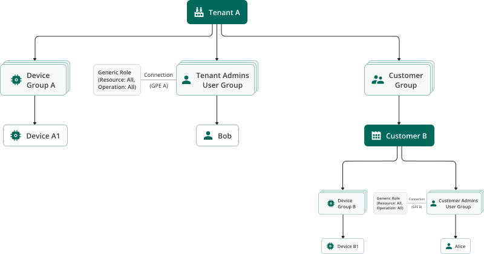

import { Steps, Aside } from '@astrojs/starlight/components';
import {Image} from "@astrojs/starlight/components";

Role-Based Access Control (RBAC) in ThingsBoard provides a structured security model that governs what actions authenticated users can perform on entities and resources within the platform. RBAC ensures scalable, secure user access by defining roles with specific permissions and assigning them according to organizational needs.

## Access control model

Access is granted by assigning roles to user groups. Roles define what operations are allowed on specific resource types. Optionally, permissions can be restricted to specific entity groups.

Permissions are evaluated at API level for every secured operation.

## Role types

ThingsBoard PE supports two role types:

| Role type | Scope model                            | Use case                      |
| --------- | -------------------------------------- | ----------------------------- |
| Generic   | Recursive within Tenant/Customer scope | Broad administrative access   |
| Group     | Specific entity group only             | Segmented and isolated access |

**When to use:**
- Use **Generic roles** for hierarchical, scope-wide access.
- Use **Group roles** for precise access to specific entity groups.

### Generic role

A **Generic role** defines permissions that apply recursively to all entities within a selected scope: **Tenant**, **Customer**, or **Sub-customer** (including all descendants).

Generic roles are not limited to specific entity groups. They apply to all entities within the scope where the role is assigned.

In ThingsBoard, a **Group Permission Entity (GPE)** is used to assign a Generic role to a User group.  
The GPE defines:
- **User group** — who receives the permissions
- **Scope** — Tenant or Customer level
- **Role** — the set of permissions

Effective permissions are determined by the combination:

```
User group + Scope + Role
```

#### Creating a generic role

<Steps>
  1. Navigate to **Security &#8702; Roles**.
  2. Click **+ Add role**.
  3. Fill in the **Name** — unique role name
  4. **Role type** — select **Generic**
  5. Configure **Permissions**: **Resource** and **Operations**  
  (At least one permission entry must be specified).
  6. Click **Add**.
</Steps>

#### Assigning a generic role

To apply a Generic role:

<Steps>
1. Open **Users &#8702; Groups** (Tenant level)  
or  
Open **Customers &#8702; Manage customer users &#8702; Groups** (Customer level).
2. Open group details.
3. Navigate to **Roles** tab.
4. Click **Add**.
5. Select:  
  &#8226;&#8194;**Role type**: *Generic*  
  &#8226;&#8194;Choose the created role
6. Click **Add**.
</Steps>

The role now applies recursively within the group’s scope.

#### Key Characteristics of Generic Roles

- Apply recursively within scope.
- Scope depends on assignment level (Tenant or Customer).
- Use GPE (Group Permission Entity) for binding.
- Permissions are cumulative across roles.
- Absence of permission results in denial.
- Do not require entity groups.

#### When to use generic roles

- Use Generic Roles when:
- Defining broad permission models.
- Granting tenant-wide administrative rights.
- Implementing hierarchical customer access.
- Creating reusable enterprise-level access templates.

### Group role

A **Group** role defines a set of permissions for a specific **user group** over a specific **entity group**.

Unlike Generic roles (which apply recursively within a Tenant or Customer scope), a Group role restricts access to a defined subset of entities.

The relationship **who → to what → with which rights** is implemented via a **Group Permission Entity (GPE)** that links:
- User Group
- Entity Group
- Group Role (permissions)

This enables precise, group-level access control without granting broader scope permissions.

#### Creating a group role

<Steps>
  1. Navigate to **Security &#8702; Roles**.
  2. Click **+ Add role**.
  3. Fill in the **Name** — unique role name
  4. **Role type** — select **Group**
  5. Under **Permissions**, specify required **operations**.  
  (At least one permission entry must be specified).
  6. Click **Add**.
</Steps>

The Group role is now available for assignment to entity groups.

#### When to Use Group Roles

Use Group roles when:
- Access must be restricted to specific device groups.
- Organizational segmentation is required (by building, department, project, region).
- Multiple teams manage different subsets of resources.
- Fine-grained isolation is required within the same tenant.

## Examples

### Example: Generic role scope

The scope of a Generic role depends entirely on where the user group exists and where the role is assigned.

**Scenario**

**Devices:**
- **Device A1** — owned by **Tenant A**
- **Device B1** — owned by **Customer B**

**Users:**
- **Bob** - member of **Tenant Admins** group at **Tenant A**.
- **Alice** - member of **Customer Admins** group at **Customer B**.

**Objective**
- Grant **Bob** full access to all entities within **Tenant A**, including entities of **all customers and sub-customers**.
- Grant **Alice** full access only within **Customer B and its sub-customers**.

##### Step 1. Create the generic role

Create a role with:
- **Role type:** *Generic*
- **Permissions:**
  - **Resource:** *All*
  - **Operations:** *All*

The role is now ready for assignment.

[//]: # ()

##### Step 2 — Assign generic role at tenant level (Bob)

<Steps>
1. Navigate to the **Users &#8702; Groups**.
3. Open **Tenant Admins** group details.
4. Open the **Roles** tab.
5. Click **Add**.
6. Select:  
  &#8226;&#8194;**Role type:** *Generic*  
  &#8226;&#8194;Choose the created role
7. Click **Add**.
</Steps>

Bob can perform any operation on all entities that belong to **Tenant A**, including entities under Customer A, Customer B, and their sub-customers.

##### Step 3 — Assign generic role at customer level (Alice)

<Steps>
1. Go to **Customers**.
2. Click **Manage customer users** for Customer B.
3. Navigate to the Groups tab. 
3. Open **Customer Admins** group details.
5. Open the **Roles** tab.
6. Click **Add**.
7. Select:  
  &#8226;&#8194;**Role type:** *Generic*  
  &#8226;&#8194;Choose the same role
8. Click **Add**.
</Steps>

Alice can perform any operation only on entities that belong to **Customer B** and its sub-customers.

##### Access Verification

- Sign in as the Tenant Administrator **Bob**. Bob sees *Device A1* and *Device B1*.
- Then sign in as the Customer User **Alice**. Alice sees *Device B1* only.

##### Outcome

- Both users have access to **Device B1**.
- Only Bob has access to **Device A1** because his Generic role is assigned at the **Tenant** level.

### Example: Isolated Access by Device Group

**Scenario**

**User groups**
- **Building A Admins** (includes Alice)
- **Building B Admins** (includes Bob)

**Device groups**
- **Building A** (contains Device A1)
- **Building B** (contains Device B1)

**Objective**
- Grant **Alice** read/write access to devices in **Building A** only.
- Grant **Bob** read/write access to devices in **Building B** only.
- Prevent cross-access between groups.

##### Step 1. Create the group role

Create a role with:
- **Role type:** *Group*
- **Permissions:**
  - **Operations:** *Read*, *Write*

Save the role.

##### Step 2 — Assign group role to "Building A" device group

<Steps>
  1. Navigate to the **Devices &#8702; Groups**.
  3. Open **Building A** group details.
  4. Go to the **Permissions** tab.
  5. Click **+** (**Add**).
  6. Specify:  
  &#8226;&#8194;The created **Group role**  
  &#8226;&#8194;**Owner**  
  &#8226;&#8194;**User group:** *Building A Admins*
  7. Click **Add**.
</Steps>

Permission is assigned.

##### Step 3 — Assign group role to "Building B" device group

Repeat the same steps for **Building B**:

<Steps>
  1. Open **Building B** group details.
  2. Go to **Permissions**.
  3. Click **+** (**Add**).
  4. Select:  
  &#8226;&#8194;The same **Group role**  
  &#8226;&#8194;**Owner**  
  &#8226;&#8194;**User group:** *Building B Admins*
  5. Click **Add**.
</Steps>

Permission is assigned.

##### Access verification

Login as **Alice** → She sees only:
- Device group **Building A**
- **Device A1**

Login as **Bob** → He sees only:
- Device group **Building B**
- **Device B1**

Users cannot access devices outside their assigned entity group.

##### Outcome

- Both users have access to **Device B1**.
- Only Bob has access to **Device A1** because his Generic role is assigned at the **Tenant** level.
